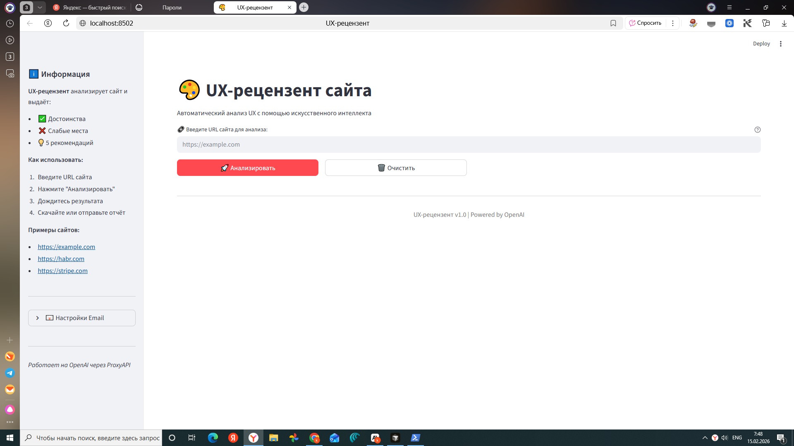
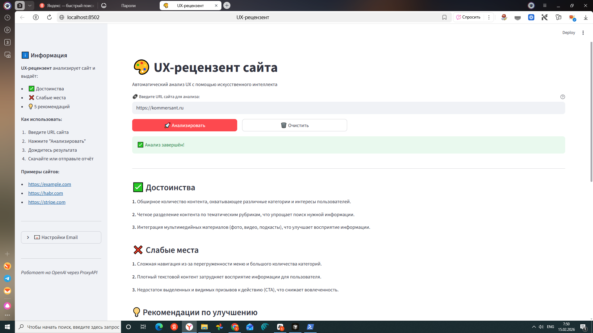
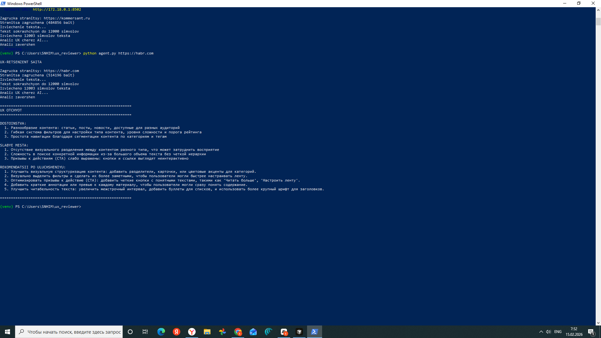
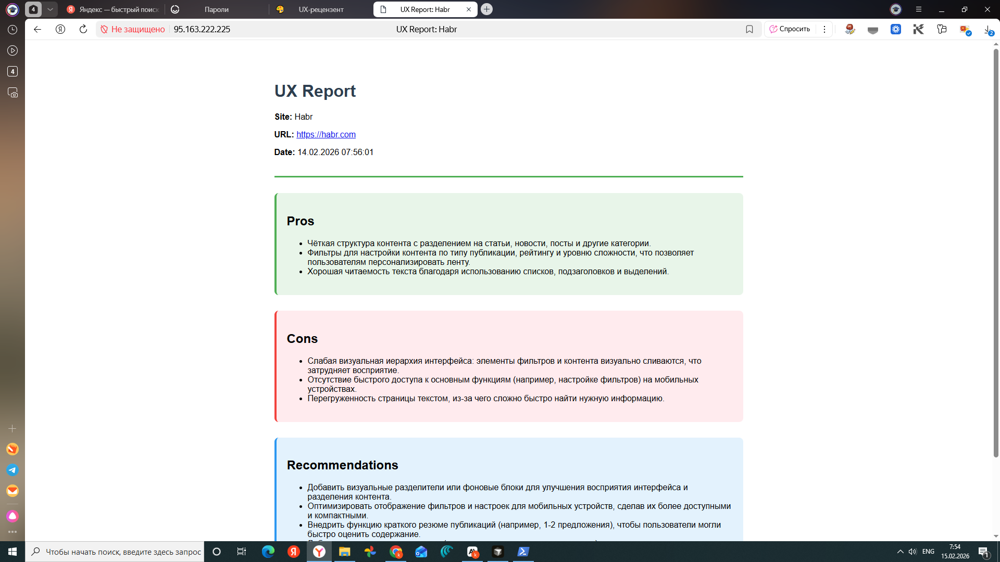
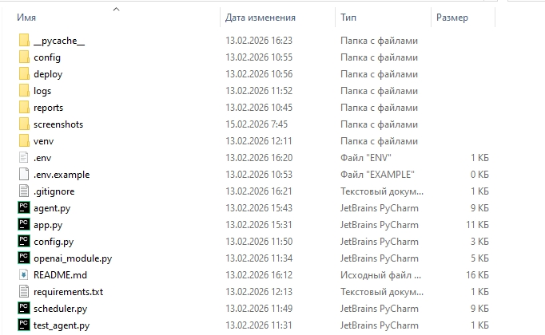

# 🎨 UX-рецензент сайта

Автоматический анализ UX веб-страниц с использованием искусственного интеллекта.

## 📋 Описание
---
UX-рецензент анализирует текстовое содержимое сайта и генерирует профессиональный отчёт с:
- ✅ **Достоинствами** - что сделано хорошо (2-3 пункта)
- ❌ **Слабыми местами** - проблемы юзабилити (2-3 пункта)  
- 💡 **Рекомендациями** - 5 конкретных предложений по улучшению

[](https://www.python.org/)
[](https://openai.com/)
[](https://streamlit.io/)
[](LICENSE)


[🔗 Демо на сервере](http://95.163.222.225) | [📖 Документация](#использование) | [🚀 Деплой](#деплой-на-сервер)

---

## 📸 Скриншоты

### Веб-интерфейс (Streamlit)



### CLI интерфейс


### HTML отчёт


### Структура проекта


---

## 🎯 Возможности

- 🖥️ **3 режима работы:** CLI, веб-интерфейс, автоматизация
- 🤖 **AI анализ:** GPT-4o через ProxyAPI
- 📊 **Экспорт:** JSON, HTML, Email
- ⏰ **Автоматизация:** Cron для регулярного мониторинга
- 🌐 **Production ready:** Развёрнут на VPS сервере
- 📝 **Логирование:** Полная трассировка операций


## 🚀 Быстрый старт

### 1. Установка зависимостей
```bash
# Создание виртуального окружения
python -m venv venv

# Активация
source venv/bin/activate  # Linux/Mac
venv\Scripts\activate     # Windows

# Установка зависимостей
pip install -r requirements.txt
```

## 🐳 Запуск через Docker
```bash
# Сборка
docker build -t ux-analyzer .

# Запуск
docker run -p 8501:8501 -e PROXIAPI_API_KEY=ваш_ключ ux-analyzer
```

Открой в браузере: **http://localhost:8501**

### 2. Настройка

Создайте файл `.env`:
```env
# ProxyAPI настройки (ОБЯЗАТЕЛЬНО)
PROXIAPI_API_KEY=ваш_ключ_от_proxyapi.ru
PROXIAPI_BASE_URL=https://api.proxyapi.ru/openai/v1
OPENAI_MODEL=gpt-4o

# Email настройки (ОПЦИОНАЛЬНО)
SMTP_HOST=smtp.yandex.ru
SMTP_PORT=587
SMTP_USER=your@yandex.ru
SMTP_PASSWORD=пароль_приложения
```

> 💡 **Получить ключ ProxyAPI:** https://proxyapi.ru  
> 💡 **Пароль приложения Yandex:** https://id.yandex.ru/security/app-passwords

### 3. Запуск

#### Вариант А: Веб-интерфейс (рекомендуется)
```bash
streamlit run app.py
```

Откроется браузер с адресом `http://localhost:8501`

#### Вариант Б: Командная строка
```bash
# Анализ одного сайта
python agent.py https://example.com

# Анализ списка сайтов
python scheduler.py
```

## 💻 Использование

### 🌐 Веб-интерфейс (Streamlit)

Самый удобный способ использования:

1. Запустите: `streamlit run app.py`
2. Откроется веб-интерфейс
3. Введите URL сайта
4. Нажмите "🚀 Анализировать"
5. Дождитесь результата (5-15 секунд)
6. **Скачайте** отчёт (JSON/TXT) или **отправьте на email**

**Возможности веб-интерфейса:**
- ✅ Красивое отображение результатов
- 📥 Скачивание отчётов в JSON/TXT
- 📧 Отправка отчётов на email
- 🔄 Повторный анализ одним кликом
- ℹ️ Боковая панель с инструкциями

### 🖥️ Командная строка (CLI)

#### Анализ одного сайта
```bash
python agent.py https://stripe.com
```

**Пример вывода:**
```
UX-RETSENZENT SAITA

Zagruzka stranitsy: https://stripe.com
Stranitsa zagruzhena (125489 bait)
Izvlechenie teksta...
Izvlecheno 12000 simvolov teksta
Analiz UX cherez AI...
Analiz zavershen

============================================================
UX OTCHYOT
============================================================

DOSTOINSTVA:
  1. Чёткая структура с понятной навигацией
  2. Выраженные призывы к действию
  3. Профессиональный дизайн

SLABYE MESTA:
  1. Перегруженность информацией на главной
  2. Недостаточно примеров использования
  3. Отсутствие FAQ секции

REKOMENDATSII PO ULUCHSHENIYU:
  1. Добавить интерактивную демонстрацию продукта
  2. Разместить отзывы клиентов на видном месте
  3. Создать раздел с кейсами и примерами
  4. Улучшить контраст CTA-кнопок
  5. Добавить поисковую строку для документации

============================================================
```

### 📊 Автоматический анализ списка сайтов

**1. Настройте список в `config/sites.yaml`:**
```yaml
sites:
  - url: https://yoursite.com
    name: Your Main Site
    enabled: true
    
  - url: https://competitor.com
    name: Competitor Site
    enabled: true
    
  - url: https://test.com
    name: Test Site
    enabled: false  # Отключен
```

**2. Запустите:**
```bash
python scheduler.py
```

**3. Результаты сохраняются в:**
- `reports/json/` - JSON формат
- `reports/html/` - HTML формат (красиво отформатированные)
- `logs/` - логи работы

**4. HTML отчёт можно открыть в браузере:**
```bash
# Windows
start reports\html\*.html

# Linux/Mac
open reports/html/*.html
```

### 📧 Email уведомления

#### Настройка для Yandex:

1. Перейдите: https://id.yandex.ru/security/app-passwords
2. Создайте пароль приложения
3. Добавьте в `.env`:
```env
SMTP_HOST=smtp.yandex.ru
SMTP_PORT=587
SMTP_USER=your@yandex.ru
SMTP_PASSWORD=пароль_приложения_16_символов
```

#### Настройка для Gmail:

1. Включите 2FA: https://myaccount.google.com/security
2. Создайте App Password: https://myaccount.google.com/apppasswords
3. Добавьте в `.env`:
```env
SMTP_HOST=smtp.gmail.com
SMTP_PORT=587
SMTP_USER=your@gmail.com
SMTP_PASSWORD=abcdefghijklmnop
```

### 🐍 Использование из Python кода
```python
from agent import run

# Анализ сайта
report = run("https://example.com")

# Доступ к данным
print(report.pros)              # Достоинства
print(report.cons)              # Проблемы  
print(report.recommendations)   # Рекомендации

# Вывод отчета
print(report)
```

## 📁 Структура проекта
```
ux_reviewer/
├── agent.py              # CLI агент для анализа
├── openai_module.py      # Работа с OpenAI API через ProxyAPI
├── scheduler.py          # Планировщик для автоматического анализа
├── config.py             # Конфигурация приложения
├── app.py                # Веб-интерфейс (Streamlit)
├── requirements.txt      # Зависимости Python
├── .env                  # API ключи и настройки (не коммитить!)
├── .env.example          # Пример конфигурации
├── .gitignore           
├── README.md            
│
├── config/
│   └── sites.yaml       # Список сайтов для мониторинга
│
├── reports/             # Сгенерированные отчеты
│   ├── json/            # JSON отчёты
│   └── html/            # HTML отчёты
│
├── logs/                # Логи работы
│
└── deploy/              # Скрипты для деплоя на сервер
    ├── deploy.sh
    ├── setup_cron.sh
    └── README_DEPLOY.md
```

## 🛠️ Технологии

- **Python** 3.10+
- **OpenAI API** через ProxyAPI.ru (gpt-4o)
- **Streamlit** - веб-интерфейс
- **BeautifulSoup4** - парсинг HTML
- **Requests** - HTTP запросы
- **Tenacity** - retry логика
- **PyYAML** - конфигурация
- **Python-dotenv** - переменные окружения
- **smtplib** - отправка email

## ⚙️ Конфигурация

### Переменные окружения (.env)

| Переменная | Описание | Обязательно | По умолчанию |
|-----------|----------|-------------|--------------|
| `PROXIAPI_API_KEY` | API ключ ProxyAPI | ✅ Да | - |
| `PROXIAPI_BASE_URL` | Base URL ProxyAPI | ⚪ Нет | https://api.proxyapi.ru/openai/v1 |
| `OPENAI_MODEL` | Модель OpenAI | ⚪ Нет | gpt-4o |
| `MAX_TEXT_LENGTH` | Максимальная длина текста | ⚪ Нет | 12000 |
| `REQUEST_TIMEOUT` | Таймаут запросов (сек) | ⚪ Нет | 15 |
| `SMTP_HOST` | SMTP сервер | ⚪ Нет | smtp.gmail.com |
| `SMTP_PORT` | SMTP порт | ⚪ Нет | 587 |
| `SMTP_USER` | Email для отправки | ⚪ Нет | - |
| `SMTP_PASSWORD` | Пароль приложения | ⚪ Нет | - |

## 📊 Примеры отчетов

### JSON отчет
```json
{
  "url": "https://example.com",
  "analyzed_at": "2026-02-13T12:30:45",
  "pros": [
    "Минималистичный дизайн",
    "Чёткое сообщение"
  ],
  "cons": [
    "Отсутствие навигации",
    "Нет призыва к действию"
  ],
  "recommendations": [
    "Добавить CTA",
    "Улучшить структуру",
    "Добавить навигацию",
    "Повысить контрастность",
    "Добавить заголовки"
  ]
}
```

### HTML отчет

Красиво отформатированный HTML с:
- 🎨 Цветовыми блоками для каждой секции
- 📱 Адаптивным дизайном
- 🖨️ Готовностью к печати
- 🔗 Активными ссылками

## 🚀 Деплой на сервер

Проект можно развернуть на сервере для автоматического мониторинга сайтов.

### Быстрый деплой на reg.ru:
```bash
# 1. Загрузите проект на сервер
scp -r ux_reviewer username@your-server.reg.ru:/var/www/

# 2. Запустите деплой
cd /var/www/ux_reviewer
bash deploy/deploy.sh

# 3. Настройте cron для автоматического запуска
bash deploy/setup_cron.sh
```

Подробная инструкция: `deploy/README_DEPLOY.md`

## 🔄 Автоматизация (cron)

### Linux/macOS:
```bash
# Редактировать crontab
crontab -e

# Запускать каждый день в 2:00 ночи
0 2 * * * cd /path/to/ux_reviewer && /path/to/venv/bin/python scheduler.py >> logs/cron.log 2>&1
```

### Windows (Task Scheduler):

1. Откройте Task Scheduler
2. Создайте новую задачу
3. Триггер: ежедневно в 2:00
4. Действие: запуск `python scheduler.py`

## ❗ Обработка ошибок

Агент корректно обрабатывает:
- ❌ Недоступные сайты (timeout, 404, 500)
- ❌ Ошибки API (с 3 автоматическими повторами)
- ❌ Некорректный формат ответа
- ❌ Страницы без текстового контента
- ❌ Проблемы с кодировкой
- ❌ Ошибки отправки email

## 🐛 Решение проблем

### "PROXIAPI_API_KEY не найден"

Убедитесь что файл `.env` создан:
```bash
cp .env.example .env
nano .env  # Добавьте ключ
```

### "authentication failed" при отправке email

Для Yandex/Gmail используйте **пароль приложения**, не обычный пароль!

### "Couldn't find a tree builder with the features you requested: lxml"

В `agent.py` замените `'lxml'` на `'html.parser'`

### Ошибки импорта модулей

Активируйте виртуальное окружение:
```bash
source venv/bin/activate  # Linux/Mac
venv\Scripts\activate     # Windows
```

### Streamlit не запускается
```bash
pip install streamlit --upgrade
streamlit run app.py
```

## 📝 Требования

- Python ≥ 3.10
- Активный API ключ ProxyAPI.ru
- Интернет-соединение
- ~100 МБ свободного места (для venv и зависимостей)

## 🚧 Известные ограничения

- Анализирует только текстовое содержимое (не визуальный дизайн)
- Максимум 12000 символов текста (для оптимизации токенов)
- Не анализирует интерактивные элементы (формы, анимации)
- Требует JavaScript-free версию страницы
- VK.com и Yandex.ru могут не анализироваться (мало текста)

## 🎯 Примеры использования

### Хорошо работает на:
- ✅ Блоги (Habr, Medium)
- ✅ Лендинги (Stripe, продуктовые страницы)
- ✅ Корпоративные сайты
- ✅ E-commerce (страницы товаров с описанием)
- ✅ Документация и Wiki

### Может быть недостаточно текста:
- ⚠️ Соцсети (VK, Facebook)
- ⚠️ Поисковики (Google, Yandex)
- ⚠️ Видео-платформы (YouTube)

## 📄 Лицензия

MIT License

## 👨‍💻 kbt2009@yandex.ru

Проект создан для курса по Вайб-кодингу

---

## 🔗 Полезные ссылки

- [ProxyAPI.ru](https://proxyapi.ru) - Получить API ключ
- [OpenAI Models](https://platform.openai.com/docs/models) - Документация моделей
- [Streamlit Docs](https://docs.streamlit.io) - Документация Streamlit
- [BeautifulSoup Docs](https://www.crummy.com/software/BeautifulSoup/bs4/doc/) - Парсинг HTML

---

💡 **Совет**: Для лучших результатов анализируйте страницы с достаточным текстовым содержимым (от 500 символов).

🚀 **Быстрый старт**: `streamlit run app.py` → Введите URL → Получите отчёт за 10 секунд!
